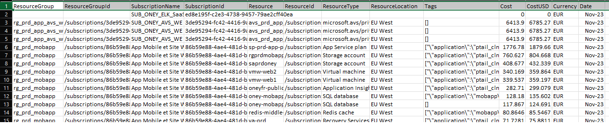
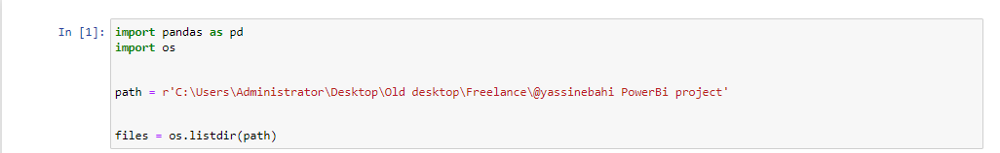

# Azure-cost-analysis-using-billing-data
## Overview
This project showcases my comprehensive solution for handling Azure billing data efficiently. Leveraging multiple CSV files, the project extracts pertinent information and transforms it into a format conducive to analysis. The extracted data is then utilized to construct a dynamic and interactive dashboard tailored to meet my client's specific requirements. Explore this repository to gain insights into effective utilization of Azure billing data and the creation of informative  dashboards to enhance decision-making processes.

## Client requirements
My client receives monthly billing data from Azure which comes in a csv file. He stores these csv files in the same directory. He wanted a Power BI dashboard to analyze Azure costs using this billing data.The dashboard was to enable flexible cost analysis based on "env" and "app" tags, as well as filters for month/year, subscription, resource, and resource type. The dashboard was also supposed to enable seamless loading of new CSV files, automatically updating the dashboard with new datai.e when a new csv file is added to the directory, the data was supposed to be update to include data from the new csv.

## Methodology
I decided to use python to import the data into Power BI(Python script) so I can easily clean, transform, and concatenate the data from the different csv files.

### The data
This is the format of the data in the CSV file. The contents are partially hidden to respect the client's privacy:

Each csv has the following columns and data for the month: ResourceGroup, ResourceGroupId, SubscriptionName, SubscriptionId, Resource, ResourceId, ResourceType, ResourceLocation, Tags, Cost, CostUSD,Currency , and Date for the month.

## Python Script
First, I imported the required modules;
1. Pandas: to clean, transform, and manipulate the data
2. Os: to read the csv files and interact with the files in directory

I also got a list of all the files in the directory/folder

