# Azure-cost-analysis-using-billing-data
## Overview
This project showcases my comprehensive solution for handling Azure billing data efficiently. Leveraging multiple CSV files, the project extracts pertinent information and transforms it into a format conducive to analysis. The extracted data is then utilized to construct a dynamic and interactive dashboard tailored to meet my client's specific requirements. Explore this repository to gain insights into effective utilization of Azure billing data and the creation of informative  dashboards to enhance decision-making processes.

## Client requirements
My client receives monthly billing data from Azure which comes in a csv file. He stores these csv files in the same directory. He wanted a Power BI dashboard to analyze Azure costs using this billing data. The dashboard was to enable flexible cost analysis based on "env" and "app" tags, as well as filters for month/year, subscription, resource, and resource type. The dashboard was also supposed to enable seamless loading of new CSV files, automatically updating the dashboard with new data i.e when a new csv file is added to the directory, the dashboard's data was supposed to be updated to include data from the new csv.  

I decided to use python to import the data into Power BI(Using the Python script source) so I can easily clean, transform, and concatenate the data from the different csv files using python, a tool that I understand its ins and outs clearly.

## Data cleaning and transformation

### The data
This is the format of the data in the CSV file. The contents are partially hidden to respect the client's privacy:  
 
Each csv has the following columns and data for the month: ResourceGroup, ResourceGroupId, SubscriptionName, SubscriptionId, Resource, ResourceId, ResourceType, ResourceLocation, Tags, Cost, CostUSD,Currency , and Date for the month.

### Python Script
First, I imported the required modules;
1. Pandas: to clean, transform, and manipulate the data
2. Os: to read the csv files and interact with the files in directory

I also got a list of all the files in the directory/folder,  
  

I created a dataframe called data that will store all the data from all the csv files.  
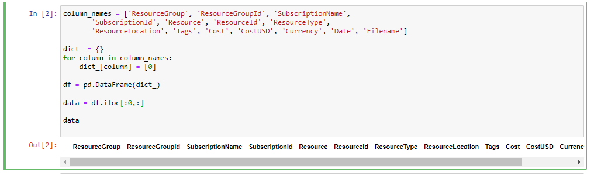  

I proceeded to read all csv files in the directory and append their data to the "data" dataframe. I added a column "filename" to show the filename of the csv where the data came from  
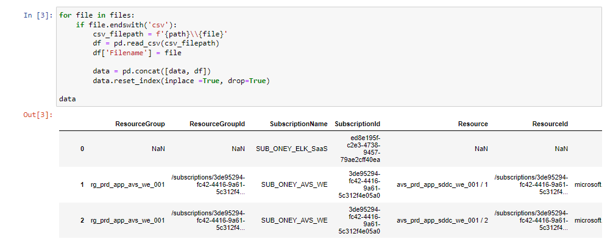  

The "Tags" column contained data for the application and environment. In this row, for example, the application was mobapp and the environment was prd  
  

For each row, I had to extract the application and environment data from the tags data. This was a bit difficult because some tags were very long and complicated, like in this one.  
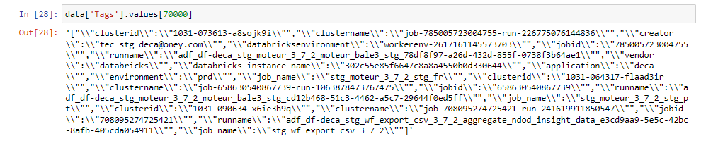  

I created this workflow to handle this dynamic nature of the string. The code also had a try except block to prevent the code from breaking in case of null values or incomplete data.  
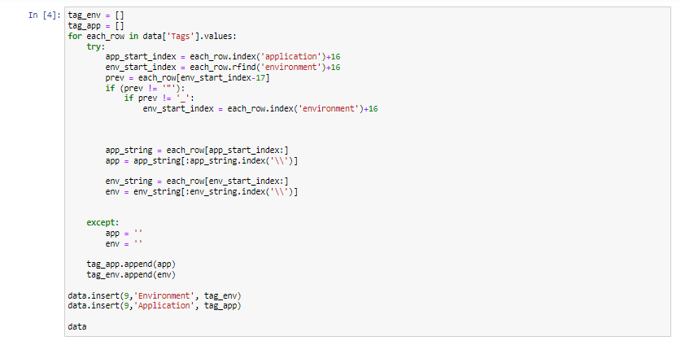  

I then added this extracted data into the "Application" and "Environment" columns of the "data" dataframe.  
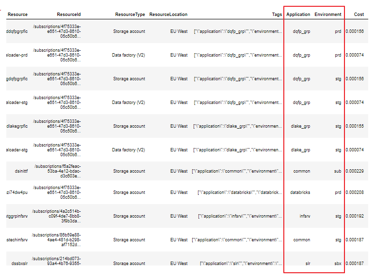  

The client also wanted me to add two columns in the data; the price of each record's application for the previous two months from the date of the bill. For example a record in the November's bill,he wanted to know the price of the app in October and September. I used this code to find the price from the record in the respective two previous months.  
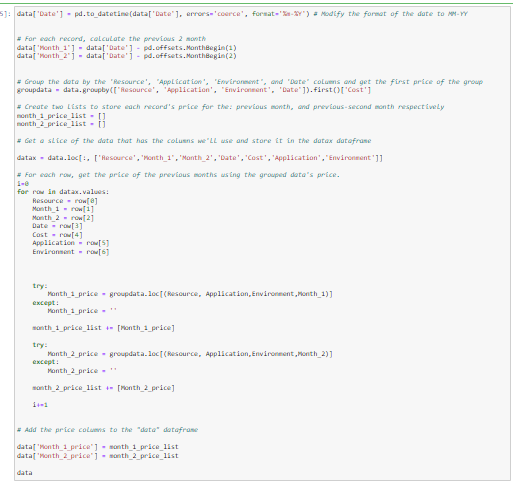  

The data was now clean, well formatted, and ready to be used for visualization   

## Visualization using Power BI
### Data Import and cleaning
I imported the data using the python script method.  
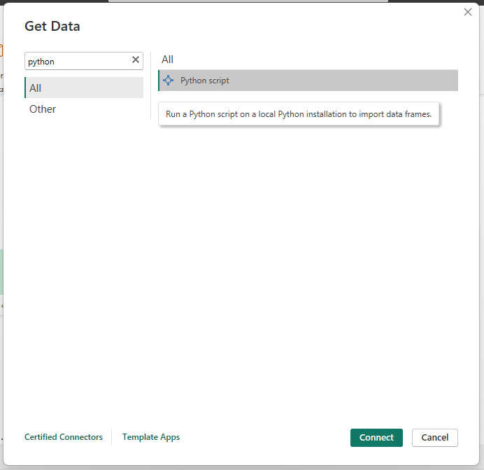  

Since the data was clean already, I used Power Query to ensure that the data had correct data types and had no errors.  
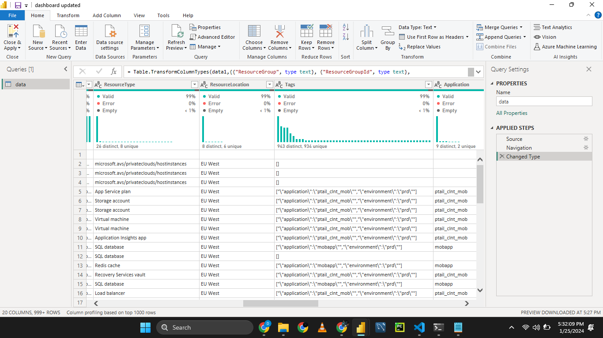  

### Visualization
These are the visualizations and insights I created, enriched with filters and drill-down capabilities.

#### Monthly trend
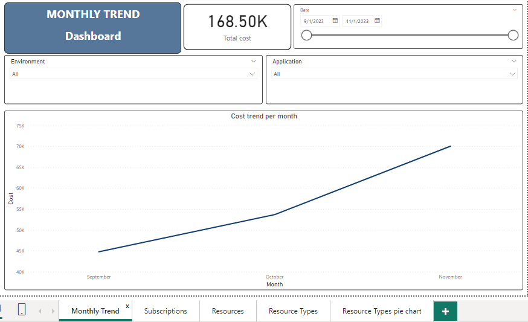  
#### Subscriptions
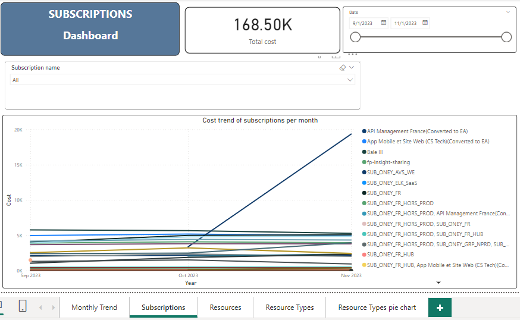  
#### Resources
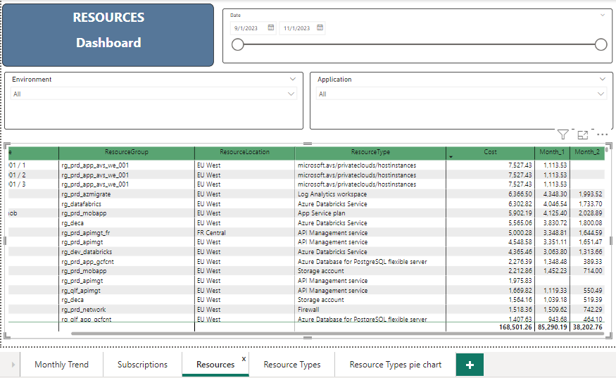  
#### Resource Types
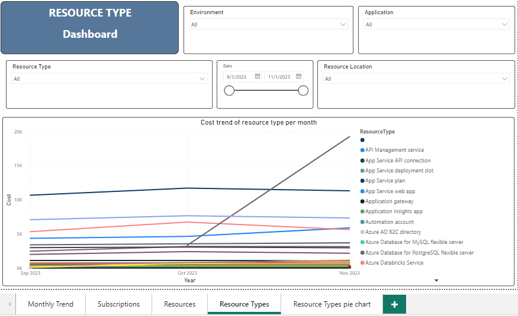  
#### Resource types Pie Chart
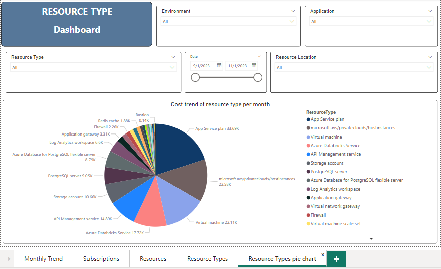  

In conclusion, this project reflects my proficiency in harnessing the power of Python for data cleaning, transformation, and extraction, and in file management, as well as showcasing my adept skills in crafting compelling data visualizations using Power BI. Through a blend of coding expertise and creative data storytelling, I have demonstrated the ability to turn raw datasets into meaningful insights. The project not only underscores my technical prowess but also reflect my commitment to delivering impactful solutions in the realm of data analytics. Your feedback and collaboration is always welcome as I continue to evolve and expand my capabilities in the dynamic field of data science.
